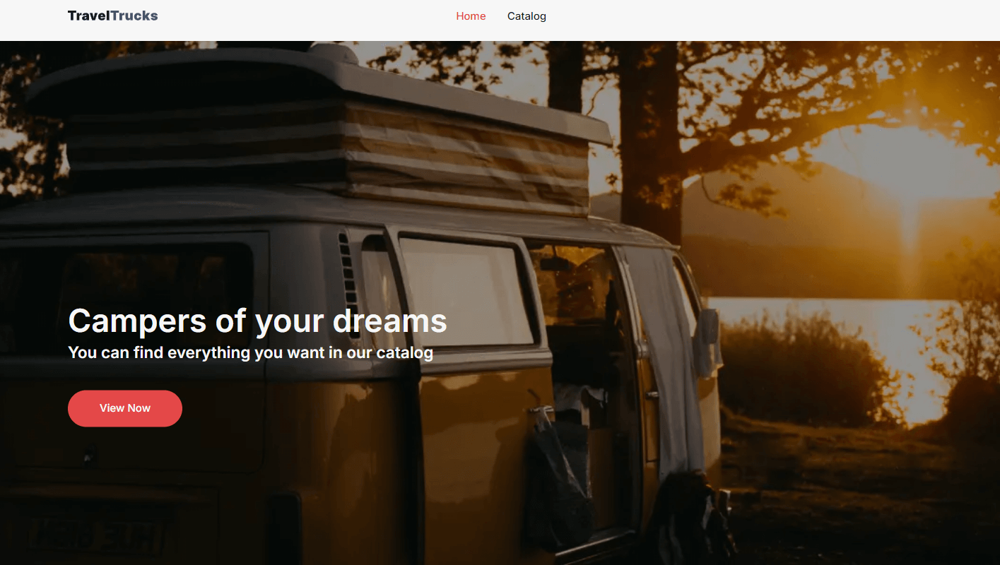
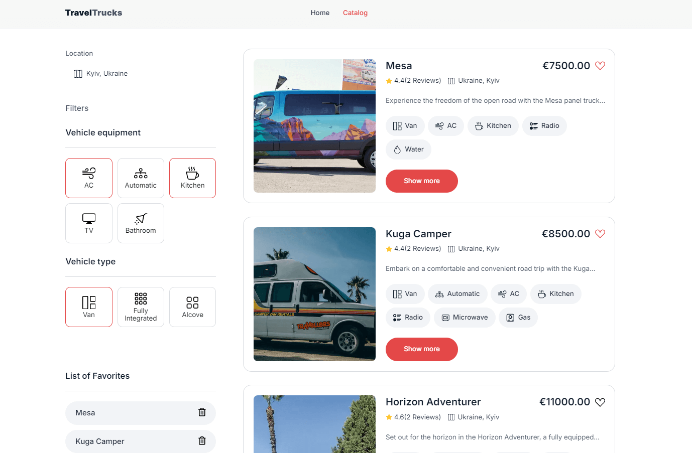
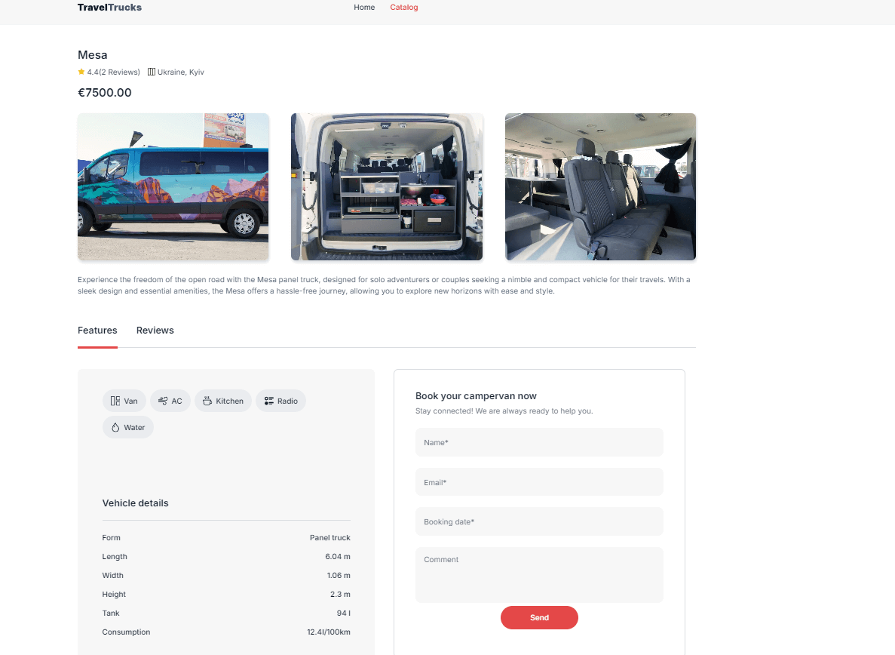
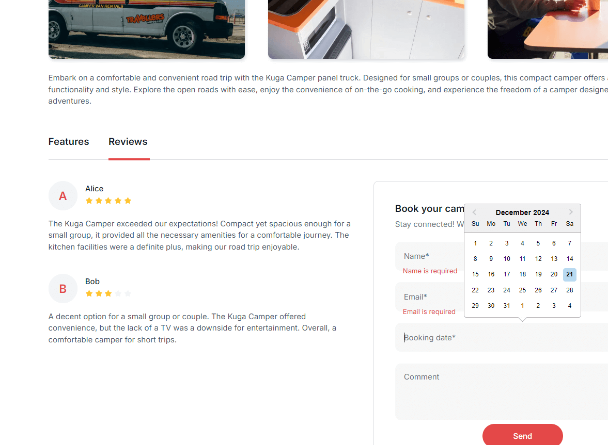

# TravelTrucks

TravelTrucks is a sleek web application developed with React and Vite, crafted
to assist users in discovering, booking, and reviewing an extensive selection of
campervans. Whether you're gearing up for a road trip or a camping getaway,
TravelTrucks provides an intuitive interface to help you find the ideal camper
for your adventure.

---

## Tech Stack

- **⚡ Vite**: Ultra-fast development environment with optimized builds.
- **⚛️ React**: The backbone for building dynamic and interactive user
  interfaces.
- **🌍 React Router**: Seamless navigation and page management.
- **🎯 Redux Toolkit**: Efficient, centralized state management for scalability
  and performance.
- **🛠️ React Hook Form & Yup**: Streamlined form handling and robust validation.
- **📅 React Datepicker**: User-friendly date selection for booking processes.
- **🖌️ CSS Modules**: Scoped and maintainable component-specific styling.

---

## Features

- **Browse Campervans**: Explore a diverse catalog of campervans.
- **Advanced Filtering**: Refine searches by location, engine type, size,
  amenities (e.g., kitchen, bathroom, air conditioning, water), price, rating,
  and more.
- **Detailed Camper Pages**: Access detailed specifications, user reviews, and
  image galleries for each camper.
- **Favorites List**: Save your favorite campers for quick access and future
  reference.
- **Booking**: Book campervans for specific dates seamlessly.
- **User Reviews**: Share your experience by adding reviews for campervans.

---

## Screenshots

### Home Page



### Catalog Page



### Features Page



### Reviews Page



## 👤 Author

**Developed by Alina Husak**

- **Email**: [alinna.husak@gmail.com](mailto:alinna.husak@gmail.com)
- **GitHub**: [Alinch96](https://github.com/Alinch96)

---

## 🚀 Quick Start

### Installation

1. Clone the repository:

   ```bash
   git clone https://github.com/Alinch96/travel-trucks.git
   cd travel-trucks
   ```

2. Install the dependencies:
   ```bash
   npm install
   # or
   yarn install
   ```

### Development Server

Run the development server:

```bash
npm run dev
# or
yarn dev
```

### Production Build

Build for production:

```bash
npm run build
# or
yarn build
```
